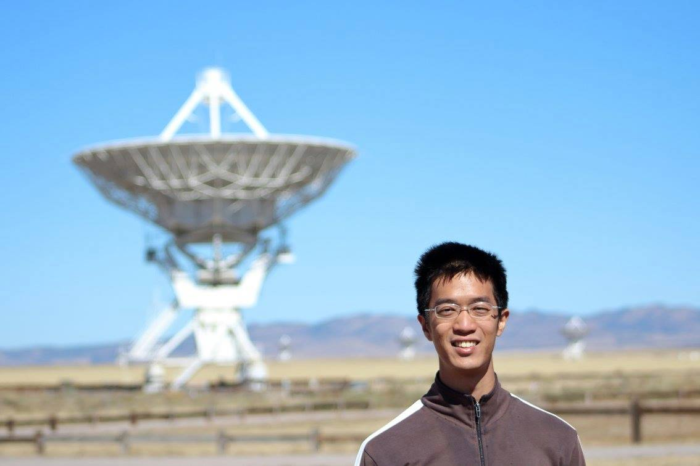

## About me
Welcome to my page! My name is I-Da Chiang (江宜達). I am a PhD candidate in astrophysics at the Center for Astrophysics and Space Sciences (CASS), University of California, San Diego (UCSD). I am a member of <a href="http://karinsandstrom.github.io/" target="_blank">Prof. Karin Sandstrom</a>'s nearby galaxy research group.

(Me and the *Karl G. Jansky* Very Large Array (VLA))
