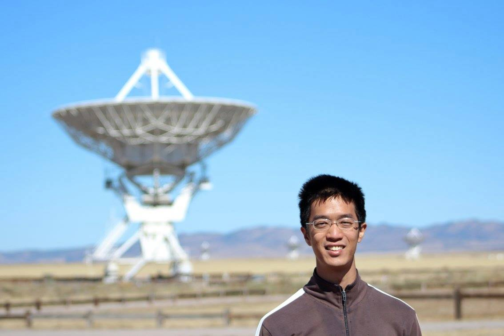

## About me

Welcome to my page! My name is I-Da Chiang (江宜達). I am a postdoc fellow at the Institute of Astronomy and Astrophysics (IAA), Academia Sinica, working with <a href="https://www.asiaa.sinica.edu.tw/people/cv.php?i=hirashita" target="_blank">Dr. Hiroyuki Hirashita</a> to combine the efforts in dust modeling and observations. I am a member of the <a href="https://ui.adsabs.harvard.edu/abs/2019ApJS..244...24L/abstract" target="_blank">z0MGS</a> and <a href="https://sites.google.com/view/phangs/home" target="_blank">PHANGS</a> collaborations. I got my Ph.D. in astrophysics (well, officially just physics) at the Center for Astrophysics and Space Sciences (CASS), University of California San Diego (UCSD). I was a member of <a href="http://karinsandstrom.github.io/" target="_blank">Prof. Karin Sandstrom</a>'s Team Nearby Galaxy group.

<a href="https://www.name-coach.com/i-da-chiang" target="_blank">How to pronounce my name?</a>

(Me and the *Karl G. Jansky* Very Large Array (VLA))
