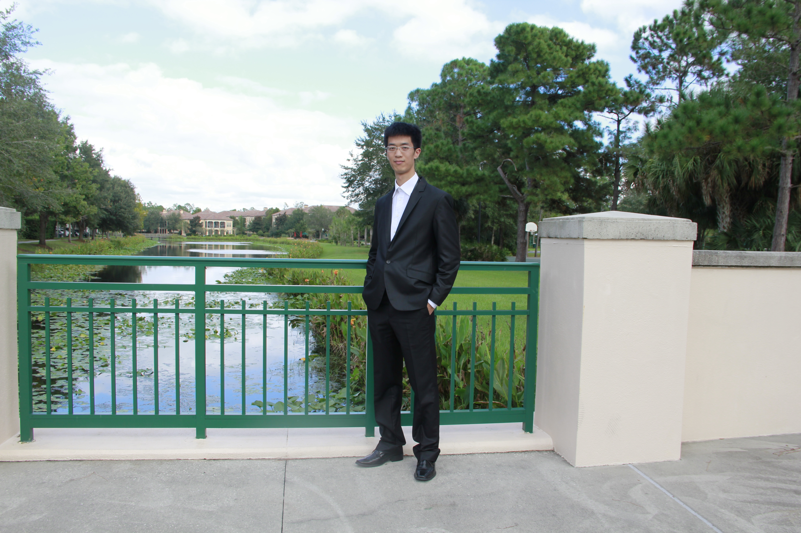

### About me
Welcome to my github page! My name is I-Da Chiang (江宜達). I am a PhD candidate in astrophysics at the <a href="http://cass.ucsd.edu/index.php/Main_Page" target="_blank">Center for Astrophysics and Space Sciences (CASS)</a>, University of California, San Diego (UCSD). I am a member of <a href="http://karinsandstrom.github.io/" target="_blank">Prof. Karin Sandstrom</a>'s nearby galaxy research group.

### The dust maps of my favorite galaxies!

(Chiang et al. in prep.)

### A photo of me

