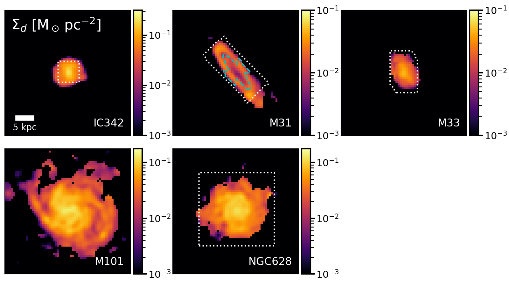

## Research

### Research interest
I am interested in the relations between *dust, metal, and neutral gas* in the interstellar medium (ISM) of
*nearby galaxies*, especially how these relations depend on local physical environments. I am also intertested in *SED fitting techniques* and *radio astronomy* in general.

(The dust maps of my favorite galaxies! Chiang et al. 2020.)

### Projects
+ Dust-to-Metals Ratio in Nearby galaxies

    Dust-to-Metals Ratio (D/M) provides keen insights into dust chemical evolution. I measure how the D/M evolves with the local enviroinment in the ISM from archival and new observations. In the first phase of this project, I built the dust-fitting techniques in one single galaxy with large metallicity gradient, M101 (Chiang et al. 2018). In the second phase, I push the study to a larger sample size and richer ISM environments. I also tested the resulting D/M with several commonly-used prescriptions of the CO-to-H2 conversion factor. I found that it is necessary to consider how ISM gas temperature and velocity dispersion affect the CO-to-H2 conversion factor to get a reasonable D/M, especially in the star-forming regions. I also proposed a novel method to constrain the D/M and the CO-to-H2 conversion factor simultaneously. I found that the D/M is roughly constant within our region of interest (Chiang et al. 2020).

+ A catalog of HI 21 cm emission in nearby galaxies observed with VLA

    I am calibrating and imaing the new HI 21 cm data observed with VLA in the EveryTHINGS project (P.I.: Karin M. Sandstrom; Chiang et al. in prep.). The EveryTHINGS project maps the HI 21 cm line in all galaxies well-resolved by *Herschel* observatory without an HI map after the VLA upgrade in the 1990's. This project has triple sample size of the successful THINGS project (Walter et al. 2008), and will expand the galaxies available for spatial resolved dust-to-gas ratio (D/G) studies. The science-ready cubes have played important roles in studying gas dynamics (Sun et al. 2020) and D/M (Chiang et al. 2020).

+ Dust Properties in the Local Group

    As you might already notice, I love nearby galaxies, and so do my colleagues. We fit the dust properties in four Local Group galaxies and study how dust mass and temperature varies within and across galaxies. We found that when we degrade the reoslution to mimic distant galaxies, we tend to get a warmer mass-weighted temperature (Utomo & Chiang et al. 2019). We also study the spatial power spectra of these maps, and find a single power-law and point source component fits well to our data. This suggests that the spatial power spectrum does not constrain the disc scale height (Koch & Chiang et al. 2020).

#### References
Chiang, I-D., Sandstrom, K. M., Chastenet, J., et al. 2018, ApJ, 865, 117.

Chiang, I-D., Sandstrom, K. M., Chastenet, J., et al. 2020, arXiv:2011.10561, accepted by ApJ.

Koch, E. W., Chiang, I-D., Utomo, D., et al. 2020, MNRAS, 492, 2663.

Sun, J., Leroy, A. K., Ostriker, E. C., et al. 2020, ApJ, 892, 148.

Utomo, D., Chiang, I-D., Leroy, A. K., et al. 2019, ApJ, 874, 141.

Walter, F., Brinks, E., de Blok, W. J. G., et al. 2008, AJ, 136, 2563.
