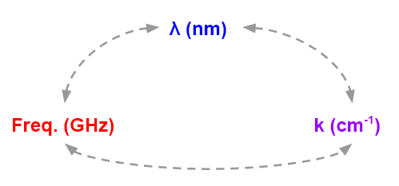

## Codes

### Wavelength unit conversion webtool

A webtool for quick conversion between wavelength units.

<a href="tools_unit">[Link to webtool]</a>

### Click and examine!

A python plotting template, which reads the clicking position and reflects on the other subplots in real time.

<a href="https://github.com/idchiang/templates/blob/master/clicking/clicking.py" target="_blank">[Link to template]</a>
